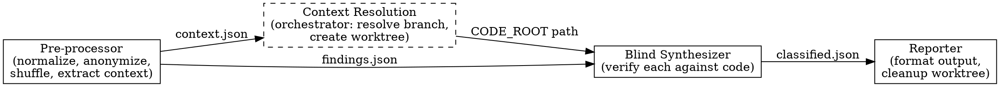

# Review Synthesis

Blind validation of multiple code review outputs. Every finding earns its place by being verified against the actual code — no source bias, no vote-counting.

## When to Use

- After running 2+ parallel code reviews (any combination of skills/tools)
- Each review's output has been saved as a `.md` file in a directory

## Setup

Each review agent writes its output to a shared directory:

```
/tmp/reviews/
  review-1.md    # Output from any review skill/tool
  review-2.md    # Output from another review skill/tool
  review-N.md    # ...
```

File names don't matter — all `.md` files in the directory are ingested.

## Process

Three sequential subagents via Task tool (`subagent_type: "general-purpose"`), with orchestrator-level context resolution between stages 1 and 2. The synthesizer never sees the original files.



### Stage 1: Pre-processor

Spawn with the **Pre-processor Prompt** below. Input: the reviews directory path.

Writes to `{dir}/_synthesis/findings.json`, `{dir}/_synthesis/pre-stats.json`, and `{dir}/_synthesis/context.json`.

### Context Resolution (orchestrator — not a subagent)

After Stage 1 completes, the orchestrator reads `{dir}/_synthesis/context.json` and ensures the synthesizer will verify code against the correct branch:

1. **Read `context.json`** — it contains branch/PR info extracted from review headers.
2. **If a branch was extracted:** fetch it and create a worktree:
   ```sh
   git fetch origin <branch>
   git worktree add {REVIEWS_DIR}/_worktree origin/<branch> --detach
   ```
   Set `CODE_ROOT={REVIEWS_DIR}/_worktree`.
3. **If no branch was extracted:** try to infer PR number from the directory name (e.g., `/tmp/reviews/131` → PR #131), then `gh pr view <number> --json headRefName` to get the branch. Create worktree as above.
4. **If neither works:** ask the user for the PR number or branch name, or confirm they are already on the correct branch. If user confirms current branch, set `CODE_ROOT` to the repository root.

### Stage 2: Blind Synthesizer

Spawn with the **Synthesizer Prompt** below. Input: `findings.json` path and `CODE_ROOT` path. **Do NOT give it access to the original review files.**

Writes to `{dir}/_synthesis/classified.json`.

### Stage 3: Reporter

Spawn with the **Reporter Prompt** below. Input: `classified.json` and `pre-stats.json`.

Displays final output to user. Cleans up `_synthesis/` directory and worktree.

---

## Pre-processor Prompt

```
You are a pre-processor for code review synthesis. Your job is to extract, normalize, anonymize, and shuffle findings from multiple review outputs.

## Input

Read every .md file in: {REVIEWS_DIR}

## Process

For each file:
1. Parse into individual findings. A "finding" is any discrete issue, observation, or recommendation.
2. Extract for each finding:
   - claim: what the reviewer says (verbatim or faithful paraphrase)
   - location: file path + line range if provided, null if not
   - severity: normalize to one of: critical | important | minor | informational
   - category: one of: security | performance | architecture | correctness | data-flow | testability | observability | hygiene | other

3. Strip ALL source metadata — no original filename, no layer name, no reviewer identity, no ordering hints.

4. Deduplicate: if two findings reference the same file + overlapping line range + semantically similar claim, merge into one. Keep the more detailed description. Track merge count.

5. Shuffle the final list randomly.

6. Extract context metadata from review headers. Look for patterns like:
   - `**Branch:** <branch> → <base>` or `**Branch:** <branch>`
   - `**PR:** #<number>` or `PR #<number>` in titles/headers
   - Any other PR/branch identifiers in the first 20 lines of each file
   If multiple files agree on a branch, use it. If they conflict, include all candidates.

## Output

Write three files:

{REVIEWS_DIR}/_synthesis/findings.json:
```json
[
  {
    "id": 1,
    "claim": "...",
    "location": { "file": "...", "lines": "42-56" },
    "severity": "important",
    "category": "correctness"
  }
]
```

{REVIEWS_DIR}/_synthesis/pre-stats.json:
```json
{
  "total_findings_raw": 0,
  "duplicates_merged": 0,
  "total_findings_after_dedup": 0,
  "findings_per_source": [5, 3, 7]
}
```

{REVIEWS_DIR}/_synthesis/context.json:
```json
{
  "branch": "feature/some-branch-name",
  "base_branch": "main",
  "pr_number": 131,
  "confidence": "high"
}
```

All fields in context.json are nullable. Set `confidence` to:
- `"high"` — all sources agree on branch/PR
- `"low"` — sources conflict or only one source had metadata
- `null` — no branch/PR info found in any review

The findings_per_source array uses index position only — no source names.

Create the _synthesis directory if it doesn't exist.
```

## Synthesizer Prompt

```
You are a blind code review synthesizer. You receive an anonymous list of findings with no information about who produced them. Your job is to verify each finding against the actual codebase.

## Principles

- Code is the only source of truth. Read the actual code for every finding.
- No vote-counting. One verified finding outweighs ten unverified ones.
- No severity inflation. A finding is only as serious as the code proves it to be.
- "No issue" is valid. If the claim is wrong, say so.

## Code Root

All file paths in findings are relative to the repository root. Read files from: {CODE_ROOT}

When a finding references `path/to/file.ts`, read `{CODE_ROOT}/path/to/file.ts`. ALWAYS prefix file paths with {CODE_ROOT} when using the Read tool.

## Input

Read: {REVIEWS_DIR}/_synthesis/findings.json

## For Each Finding

1. LOCATE: Go to the file and line range cited (under {CODE_ROOT}).
   - If the file doesn't exist → hallucination
   - If the function/variable cited doesn't exist at that location → hallucination

2. READ CONTEXT: Read surrounding code — imports, callers, related modules. Understand what the code actually does. Not just the cited lines.

3. VERIFY: Does the code actually have the issue described?
   - YES and it should change → confirmed_actionable
   - YES but it's an observation, not a bug → confirmed_informational
   - NO, the claim is factually wrong → rejected
   - NO, the code/file/function doesn't exist → hallucination
   - UNCERTAIN, requires domain knowledge or business context → needs_human

4. For confirmed_actionable: write a one-line suggested fix.
5. For needs_human: write a specific question about what you need to know.

## Output

Write to {REVIEWS_DIR}/_synthesis/classified.json:
```json
[
  {
    "id": 1,
    "claim": "...",
    "location": { "file": "...", "lines": "42-56" },
    "severity": "important",
    "category": "correctness",
    "verdict": "confirmed_actionable",
    "justification": "One line explaining why this is a real issue",
    "suggested_fix": "One line describing the fix",
    "question": null
  }
]
```

verdict is one of: confirmed_actionable | confirmed_informational | rejected | hallucination | needs_human

IMPORTANT: Do NOT read any files in the _synthesis directory other than findings.json. Do NOT attempt to identify which reviewer produced which finding.
```

## Reporter Prompt

```
You are the reporter for a code review synthesis. You take classified findings and produce the final output.

## Input

Read:
- {REVIEWS_DIR}/_synthesis/classified.json
- {REVIEWS_DIR}/_synthesis/pre-stats.json

## Output Format

Display the following markdown directly to the user:

# Review Synthesis

## Summary
- X findings analyzed, Y confirmed, Z rejected, W need your input
- Signal-to-noise ratio: Y/X (as percentage)

---

## Fix These
[confirmed_actionable findings, ordered by severity: critical > important > minor]

### 1. [Category] Brief title
**Location:** `file/path:lines`
**Issue:** One-line description
**Why it matters:** One-line impact
**Suggested fix:** From the synthesizer's output

[Continue for each...]

---

## Be Aware
[confirmed_informational findings, ordered by relevance]

### 1. [Category] Brief title
**Location:** `file/path:lines`
**Observation:** What's true
**Context:** Why worth knowing

---

## Needs Your Input
[needs_human findings]

### 1. [Category] Brief title
**Location:** `file/path:lines`
**Claim:** What was flagged
**Question:** What the synthesizer needs answered

---

## Appendix: Stats

| Metric | Count |
|--------|-------|
| Total findings ingested | from pre-stats |
| Duplicates merged | from pre-stats |
| Confirmed (actionable) | count |
| Confirmed (informational) | count |
| Needs human | count |
| Rejected (wrong) | count |
| Rejected (hallucination) | count |
| **Signal-to-noise ratio** | confirmed / total % |

### Hallucination Details
[Table of hallucinated findings with: claim, location cited, why rejected]

If no hallucinations found, write "None detected."

---

## Cleanup

After displaying output:
1. Save the full report to {REVIEWS_DIR}/synthesis-report.md
2. Delete the _synthesis directory: rm -rf {REVIEWS_DIR}/_synthesis
3. If a worktree exists at {REVIEWS_DIR}/_worktree, remove it: git worktree remove {REVIEWS_DIR}/_worktree --force
```

## Invocation Example

```
User: synthesize the reviews in /tmp/reviews/131

You:
1. Spawn pre-processor subagent with REVIEWS_DIR=/tmp/reviews/131
2. Wait for completion
3. Read _synthesis/context.json → branch found: "fix/some-feature", PR #131
4. git fetch origin fix/some-feature
5. git worktree add /tmp/reviews/131/_worktree origin/fix/some-feature --detach
6. Spawn synthesizer subagent with REVIEWS_DIR=/tmp/reviews/131, CODE_ROOT=/tmp/reviews/131/_worktree
7. Wait for completion
8. Spawn reporter subagent with REVIEWS_DIR=/tmp/reviews/131 (cleans up worktree + _synthesis)
```

If context.json has no branch info and the directory name isn't a PR number, ask the user:
```
User: synthesize the reviews in /tmp/reviews/my-feature

You:
1. Spawn pre-processor → context.json has no branch info
2. Directory name "my-feature" is not a PR number
3. Ask user: "Which PR or branch were these reviews written against?"
4. User provides: PR #42 or branch name
5. Resolve branch, create worktree, continue as above
```

## Full Workflow

The review synthesis skill is step 2 in a 3-step review pipeline:

```
1. REVIEW    →    2. SYNTHESIZE    →    3. IMPLEMENT
```

### Step 1: Run parallel reviews

Run 2+ review agents in parallel. Each writes output to `/tmp/reviews/review-{N}.md`. Add this to each review agent's prompt:

```
After completing your review, write the full review output as markdown
to /tmp/reviews/review-{N}.md using the Write tool.
Create the directory first if needed (mkdir -p /tmp/reviews).
```

Use any combination: `code-review`, `requesting-code-review`, external tools, custom prompts.

### Step 2: Synthesize (this skill)

```
synthesize the reviews in /tmp/reviews
```

This runs the blind validation pipeline and saves the report to `/tmp/reviews/synthesis-report.md`.

**Starting a new analysis?** Delete the reviews directory first to avoid mixing findings from different runs:
```
rm -rf /tmp/reviews
```

### Step 3: Implement fixes

Use `superpowers:receiving-code-review` to work through the "Fix These" section. Paste it as the review feedback. That skill enforces:

- Verify each finding against code before implementing (already done by synthesis, but double-check)
- Implement in order: blocking issues → simple fixes → complex fixes
- Test each fix individually
- Push back on anything that's wrong (with technical reasoning)

## Integration Notes

- Works with any review tool that produces markdown output
- To use with `code-review` skill: redirect each layer's output to a file
- To use with `requesting-code-review`: save the subagent's response to a file
- External tools (GitHub Copilot, etc.): copy output to a .md file in the directory
